Simple QrCode
========================

#### [Español](https://www.simplesoftware.io/docs/simple-qrcode/es) | [Français](https://www.simplesoftware.io/docs/simple-qrcode/fr) | [Italiano](https://www.simplesoftware.io/docs/simple-qrcode/it) | [Português](https://www.simplesoftware.io/docs/simple-qrcode/pt-br) | [Русский](https://www.simplesoftware.io/docs/simple-qrcode/ru) | [日本人](https://www.simplesoftware.io/docs/simple-qrcode/ja) | [한국어](https://www.simplesoftware.io/docs/simple-qrcode/kr) | [हिंदी](https://www.simplesoftware.io/docs/simple-qrcode/hi) | [汉语](https://www.simplesoftware.io/docs/simple-qrcode/zh)

- [Introduction](#docs-introduction)
- [Upgrade Guide](#docs-upgrade)
- [Configuration](#docs-configuration)
- [Simple Ideas](#docs-ideas)
- [Usage](#docs-usage)
- [Helpers](#docs-helpers)
- [Common QrCode Usage](#docs-common-usage)
- [Usage Outside of Laravel](#docs-outside-laravel)

## Try our dead simple, free file transfer service [keep.sh](https://keep.sh)

Upload files with a single curl command from your terminal! `curl --upload-file file.txt https://keep.sh`

## Introduction
Simple QrCode is an easy to use wrapper for the popular Laravel framework based on the great work provided by [Bacon/BaconQrCode](https://github.com/Bacon/BaconQrCode).  We created an interface that is familiar and easy to install for Laravel users.

 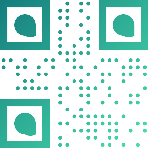

## Upgrade Guide

Upgrade from v2 by changing your `composer.json` file to `~3`

You **must** install the `imagick` PHP extension if you plan on using the `png` image format.

## Configuration

#### Composer

Run `composer require simplesoftwareio/simple-qrcode "~3"` to add the package. 

Laravel will automiatcally pick up and install the package.

## Simple Ideas

#### Print View

One of the main items that we use this package for is to have QrCodes in all of our print views.  This allows our customers to return to the original page after it is printed by simply scanning the code.  We achieved this by adding the following into our footer.blade.php file.

	

		{!! QrCode::size(100)->generate(Request::url()); !!}
		
Scan me to return to the original page.

	

#### Embed A QrCode

You may embed a qrcode inside of an e-mail to allow your users to quickly scan.  The following is an example of how to do this with Laravel.

	//Inside of a blade template.
	embedData(QrCode::format('png')->generate('Embed me into an e-mail!'), 'QrCode.png', 'image/png')!!}">

## Usage

#### Basic Usage

Using the QrCode Generator is very easy.  The most basic syntax is:

	QrCode::generate('Make me into a QrCode!');

This will make a QrCode that says "Make me into a QrCode!"

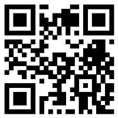

#### Generate `(string $data, string $filename = null)`

`Generate` is used to make the QrCode.

	QrCode::generate('Make me into a QrCode!');

`Generate` by default will return a SVG image string.  You can print this directly into a modern browser within Laravel's Blade system with the following:

	{!! QrCode::generate('Make me into a QrCode!'); !!}

The `generate` method has a second parameter that will accept a filename and path to save the QrCode.

	QrCode::generate('Make me into a QrCode!', '../public/qrcodes/qrcode.svg');

#### Format `(string $format)`

Three formats are currently supported; `png,` `eps,` and `svg.`  To change the format use the following code:

	QrCode::format('png');  //Will return a png image
	QrCode::format('eps');  //Will return a eps image
	QrCode::format('svg');  //Will return a svg image

> `imagick` is required in order to generate a `png` image.

#### Size `(int $size)`

You can change the size of a QrCode by using the `size` method. Simply specify the size desired in pixels using the following syntax:

	QrCode::size(100);

 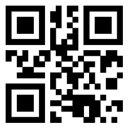 

#### Color `(int $red, int $green, int $blue, int $alpha = null)`

>Be careful when changing the color of a QrCode.  Some readers have a very difficult time reading QrCodes in color.

All colors must be expressed in RGBA (Red Green Blue Alpha).  You can change the color of a QrCode by using the following:

	QrCode::color(255, 0, 0); // Red QrCode
	QrCode::color(255, 0, 0, 25); //Red QrCode with 25% transparency 

 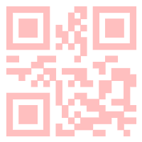

#### Background Color `(int $red, int $green, int $blue, int $alpha = null)`

You can change the background color of a QrCode by calling the `backgroundColor` method.

	QrCode::backgroundColor(255, 0, 0); // Red background QrCode
	QrCode::backgroundColor(255, 0, 0, 25); //Red background QrCode with 25% transparency 

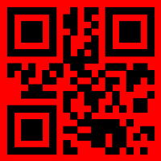 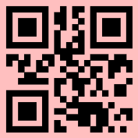

#### Gradient `$startRed, $startGreen, $startBlue, $endRed, $endGreen, $endBlue, string $type)`

You can apply a gradient to the QrCode by calling the `gradient` method.

The following gradient types are supported.

| Type | Example |
| --- | --- |
| `vertical` |  |
| `horizontal` |  |
| `diagonal` |  |
| `inverse_diagonal` |  |
| `radial` | 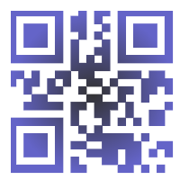 |

#### EyeColor `(int $eyeNumber, int $innerRed, int $innerGreen, int $innerBlue, int $outterRed = 0, int $outterGreen = 0, int $outterBlue = 0)`

You may change the eye colors by using the `eyeColor` method.

| Eye Number | Example |
| --- | --- |
| `0` | 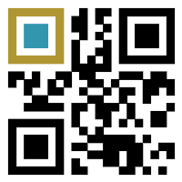 |
| `1` | 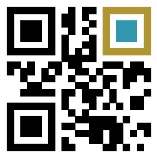|
| `2` |  |

#### Style `(string $style, float $size = 0.5)`

The style can be easily swapped out with `square.` `dot,` or `round.`  This will change the blocks within the QrCode.  The second parameter will affect the size of the dots or roundness.

| Style | Example |
| --- | --- |
| `sqaure` |  |
| `dot` | 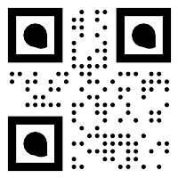|
| `round` |  |

#### Eye Style `(string $style)`

The eye within the QrCode supports two different styles, `dot` and `circle.`

| Style | Example |
| --- | --- |
| `sqaure` |  |
| `circle` | 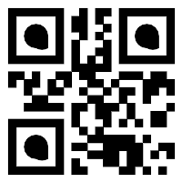|

#### Margin Change

The ability to change the margin around a QrCode is also supported.  Simply specify the desired margin using the following syntax:

	QrCode::margin(100);

#### Error Correction

Changing the level of error correction is easy.  Just use the following syntax:

	QrCode::errorCorrection('H');

The following are supported options for the `errorCorrection` method.

| Error Correction | Assurance Provided |
| --- | --- |
| L | 7% of codewords can be restored. |
| M | 15% of codewords can be restored. |
| Q | 25% of codewords can be restored. |
| H | 30% of codewords can be restored. |

>The more error correction used; the bigger the QrCode becomes and the less data it can store. Read more about [error correction](http://en.wikipedia.org/wiki/QR_code#Error_correction).

#### Encoding

Change the character encoding that is used to build a QrCode.  By default `ISO-8859-1` is selected as the encoder.  Read more about [character encoding](http://en.wikipedia.org/wiki/Character_encoding) You can change this to any of the following:

	QrCode::encoding('UTF-8')->generate('Make me a QrCode with special symbols ♠♥!!');

| Character Encoder |
| --- |
| ISO-8859-1 |
| ISO-8859-2 |
| ISO-8859-3 |
| ISO-8859-4 |
| ISO-8859-5 |
| ISO-8859-6 |
| ISO-8859-7 |
| ISO-8859-8 |
| ISO-8859-9 |
| ISO-8859-10 |
| ISO-8859-11 |
| ISO-8859-12 |
| ISO-8859-13 |
| ISO-8859-14 |
| ISO-8859-15 |
| ISO-8859-16 |
| SHIFT-JIS |
| WINDOWS-1250 |
| WINDOWS-1251 |
| WINDOWS-1252 |
| WINDOWS-1256 |
| UTF-16BE |
| UTF-8 |
| ASCII |
| GBK |
| EUC-KR |

#### Merge

The `merge` method merges an image over a QrCode.  This is commonly used to placed logos within a QrCode.

	QrCode::merge($filename, $percentage, $absolute);
	
	//Generates a QrCode with an image centered in the middle.
	QrCode::format('png')->merge('path-to-image.png')->generate();
	
	//Generates a QrCode with an image centered in the middle.  The inserted image takes up 30% of the QrCode.
	QrCode::format('png')->merge('path-to-image.png', .3)->generate();
	
	//Generates a QrCode with an image centered in the middle.  The inserted image takes up 30% of the QrCode.
	QrCode::format('png')->merge('http://www.google.com/someimage.png', .3, true)->generate();

>The `merge` method only supports PNG at this time.
>The filepath is relative to app base path if `$absolute` is set to `false`.  Change this variable to `true` to use absolute paths.

>You should use a high level of error correction when using the `merge` method to ensure that the QrCode is still readable.  We recommend using `errorCorrection('H')`.

#### Merge Binary String

The `mergeString` method can be used to achieve the same as the `merge` call, except it allows you to provide a string representation of the file instead of the filepath. This is usefull when working with the `Storage` facade. It's interface is quite similar to the `merge` call. 

	QrCode::mergeString(Storage::get('path/to/image.png'), $percentage);
	
	//Generates a QrCode with an image centered in the middle.
	QrCode::format('png')->mergeString(Storage::get('path/to/image.png'))->generate();
	
	//Generates a QrCode with an image centered in the middle.  The inserted image takes up 30% of the QrCode.
	QrCode::format('png')->mergeString(Storage::get('path/to/image.png'), .3)->generate();

>As with the normal `merge` call, only PNG is supported at this time. The same applies for error correction, high levels are recommened.

#### Advance Usage

All methods support chaining.  The `generate` method must be called last.  For example you could run any of the following:

	QrCode::size(250)->color(150,90,10)->backgroundColor(10,14,244)->generate('Make me a QrCode!');
	QrCode::format('png')->size(399)->color(40,40,40)->generate('Make me a QrCode!');

You can display a PNG image without saving the file by providing a raw string and encoding with `base64_encode`.

	size(100)->generate('Make me into an QrCode!')) !!} ">

## Helpers

#### What are helpers?

Helpers are an easy way to create QrCodes that cause a reader to perform a certain action when scanned.  

#### BitCoin

This helpers generates a scannable bitcoin to send payments.  [More information](https://bitco.in/en/developer-guide#plain-text)

	QrCode::BTC($address, $amount);
	
	//Sends a 0.334BTC payment to the address
	QrCode::BTC('bitcoin address', 0.334);
	
	//Sends a 0.334BTC payment to the address with some optional arguments
	QrCode::size(500)->BTC('address', 0.0034, [
        'label' => 'my label',
        'message' => 'my message',
        'returnAddress' => 'https://www.returnaddress.com'
    ]);

#### E-Mail

This helper generates an e-mail qrcode that is able to fill in the e-mail address, subject, and body.

	QrCode::email($to, $subject, $body);
	
	//Fills in the to address
	QrCode::email('foo@bar.com');
	
	//Fills in the to address, subject, and body of an e-mail.
	QrCode::email('foo@bar.com', 'This is the subject.', 'This is the message body.');
	
	//Fills in just the subject and body of an e-mail.
	QrCode::email(null, 'This is the subject.', 'This is the message body.');
	
#### Geo

This helper generates a latitude and longitude that a phone can read and open the location up in Google Maps or similar app.

	QrCode::geo($latitude, $longitude);
	
	QrCode::geo(37.822214, -122.481769);
	
#### Phone Number

This helper generates a QrCode that can be scanned and then dials a number.

	QrCode::phoneNumber($phoneNumber);
	
	QrCode::phoneNumber('555-555-5555');
	QrCode::phoneNumber('1-800-Laravel');
	
#### SMS (Text Messages)

This helper makes SMS messages that can be prefilled with the send to address and body of the message.

	QrCode::SMS($phoneNumber, $message);
	
	//Creates a text message with the number filled in.
	QrCode::SMS('555-555-5555');
	
	//Creates a text message with the number and message filled in.
	QrCode::SMS('555-555-5555', 'Body of the message');

#### WiFi

This helpers makes scannable QrCodes that can connect a phone to a WiFI network.

	QrCode::wiFi([
		'encryption' => 'WPA/WEP',
		'ssid' => 'SSID of the network',
		'password' => 'Password of the network',
		'hidden' => 'Whether the network is a hidden SSID or not.'
	]);
	
	//Connects to an open WiFi network.
	QrCode::wiFi([
		'ssid' => 'Network Name',
	]);
	
	//Connects to an open, hidden WiFi network.
	QrCode::wiFi([
		'ssid' => 'Network Name',
		'hidden' => 'true'
	]);
	
	//Connects to an secured, WiFi network.
	QrCode::wiFi([
		'ssid' => 'Network Name',
		'encryption' => 'WPA',
		'password' => 'myPassword'
	]);
	
>WiFi scanning is not currently supported on Apple Products.

## Common QrCode Usage

You can use a prefix found in the table below inside the `generate` section to create a QrCode to store more advanced information:

	QrCode::generate('http://www.simplesoftware.io');

| Usage | Prefix | Example |
| --- | --- | --- |
| Website URL | http:// | http://www.simplesoftware.io |
| Secured URL | https:// | https://www.simplesoftware.io |
| E-mail Address | mailto: | mailto:support@simplesoftware.io |
| Phone Number | tel: | tel:555-555-5555 |
| Text (SMS) | sms: | sms:555-555-5555 |
| Text (SMS) With Pretyped Message | sms: | sms::I am a pretyped message |
| Text (SMS) With Pretyped Message and Number | sms: | sms:555-555-5555:I am a pretyped message |
| Geo Address | geo: | geo:-78.400364,-85.916993 |
| MeCard | mecard: | MECARD:Simple, Software;Some Address, Somewhere, 20430;TEL:555-555-5555;EMAIL:support@simplesoftware.io; |
| VCard | BEGIN:VCARD | [See Examples](https://en.wikipedia.org/wiki/VCard) |
| Wifi | wifi: | wifi:WEP/WPA;SSID;PSK;Hidden(True/False) |

## Usage Outside of Laravel

You may use this package outside of Laravel by instantiating a new `Generator` class.

	use SimpleSoftwareIO\QrCode\Generator;

	$qrcode = new Generator;
	$qrcode->size(500)->generate('Make a qrcode without Laravel!');
